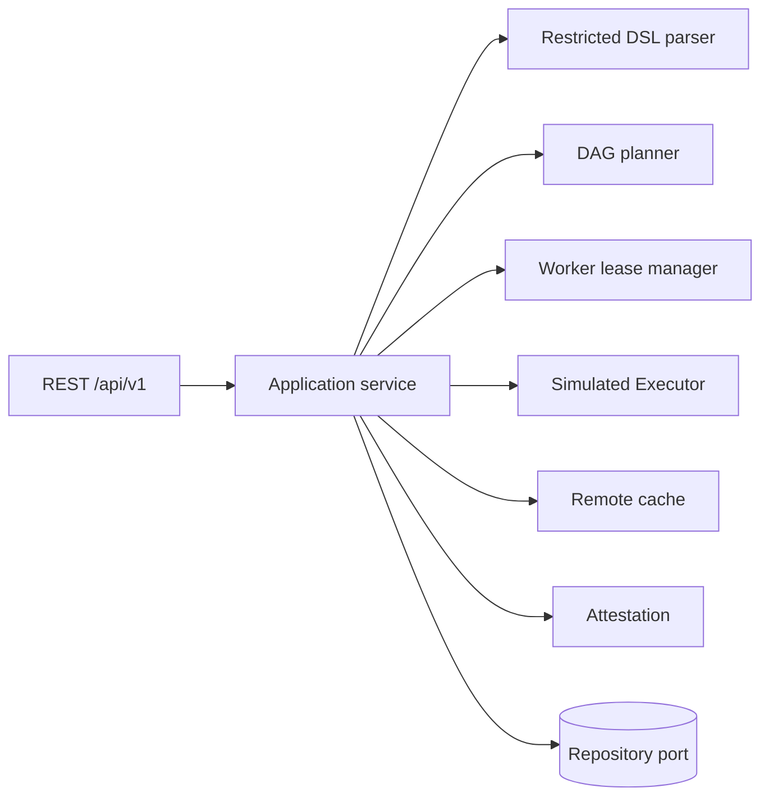

# Reproducible Build Farm

030 项目是一个纯 Go 的企业内部构建编排服务。它接收受限 JSON DSL，不执行宿主 shell；默认模拟 Executor 以确定性摘要完成构建闭环。服务包含 DAG 校验、规范化 Action key、内存远程缓存、worker 租约、配额、幂等提交和离线 attestation。

## 快速开始

```bash
go test ./...
go vet ./...
go build ./...
HTTP_ADDR=:8080 go run ./cmd/buildfarm
```

健康检查：`GET /healthz`。创建项目、定义和执行：

```bash
curl -s localhost:8080/api/v1/projects -X POST -H 'content-type: application/json' \
  -d '{"id":"demo-project","name":"demo","owner":"platform"}'
curl -s localhost:8080/api/v1/build-definitions -X POST -H 'content-type: application/json' \
  -d '{"id":"demo-definition","projectID":"demo-project","DSL":{"name":"hello","toolchain_id":"go123","steps":[{"id":"compile","args":["compile"],"outputs":["bin/app"]}]}}'
curl -s localhost:8080/api/v1/executions -X POST -H 'content-type: application/json' \
  -d '{"id":"demo-execution","definitionID":"demo-definition","idempotencyKey":"demo-1"}'
```

## 架构



领域状态机：`queued -> running -> succeeded|failed|canceled`。Action key 由项目、工具链、步骤规范化表示及输入摘要组成；缓存命中不会重新执行。attestation 包含输入根、输出根、工具链摘要、参数和 Executor 版本，签名为标准库 SHA-256 摘要，可离线校验格式。

## 运行与安全

DSL 拒绝未知字段、循环 DAG、网络访问、敏感环境变量、危险参数和不安全输出路径；Executor 只生成模拟结果。生产部署应将 `Executor` 替换为隔离容器适配器，并配置最小网络、文件系统和环境变量权限。缓存当前为内存实现，重启即丢失，真实部署需接入带 TTL 和内容校验的远程存储。

容量基线：单定义最多 1000 步、单步骤 128 参数、缓存默认 10000 条；服务目标为 p95 提交响应 <100ms，执行状态最终一致。故障演练覆盖 worker 租约过期、缓存负失效、重复幂等提交和执行取消。

## 目录

`cmd/buildfarm` 负责装配；`internal/domain` 为纯领域模型；`application` 编排用例；`dsl`、`graph`、`cache`、`worker`、`attestation` 为 bounded contexts；`transport` 提供 HTTP；`repository` 和 `infrastructure` 提供可替换适配器；`api`、`deployments`、`migrations`、`scripts` 为交付资产。
